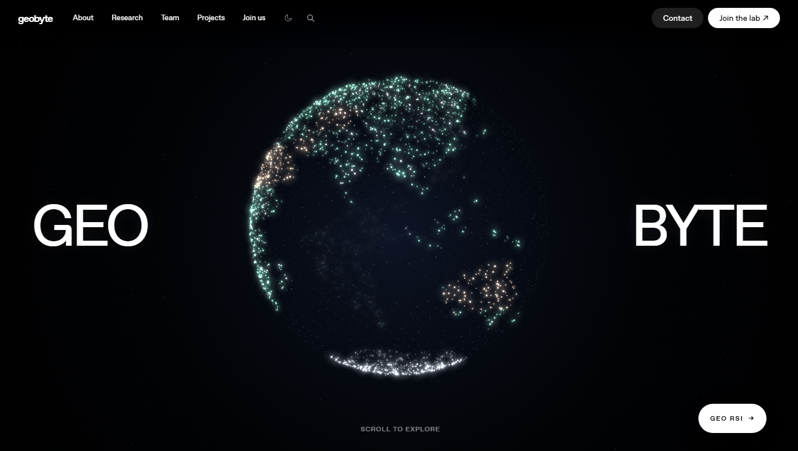
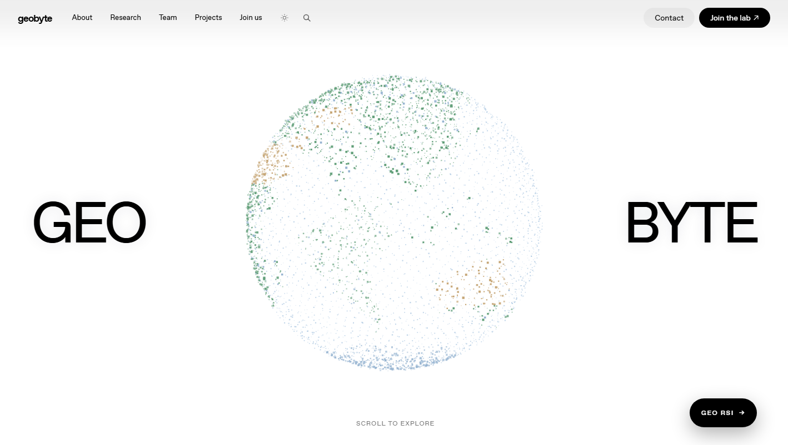

# Geobyte Lab

一个地质学 × 计算机科学交叉实验室的团队展示站。深色网格排版、由本地 Canvas 驱动的真实地理粒子地球，以及一个用胶囊按钮"四边展开"进入的 GEO RSI 子页。

**纯静态、零构建、零依赖、零第三方请求**：直接打开 `index.html`，或整目录丢到任意静态托管（GitHub Pages / Cloudflare Pages / S3）即可运行。

**在线预览：<https://applex250.github.io/geobyte-site/>**





## 页面

| 路径 | 内容 |
| --- | --- |
| `index.html` | 实验室首页：粒子地球 Hero、研究方向、团队、开源工具、论文、项目、数据资源、加入我们 |
| `geo-rsi.html` | GEO RSI：面向地质科研的 7×24 自进化 harness（左侧会话历史列表 + 中间对话 + 右侧预留仪表栏） |

## 目录

```text
.
├── index.html              首页
├── geo-rsi.html            GEO RSI 子页
├── local-effects.js        粒子引擎、主题切换、滚动编排、页面转场（全部本地）
├── local-effects.css       动效层与浅色/深色主题变量覆盖
├── geo-rsi.js              GEO RSI 的光谱曲线 Canvas
├── assets/                 本地 SVG（品牌标记、分享图）
├── fonts/                  OpenAI Sans / LF Serif 的 woff2（36 个，已本地化）
├── styles/*.css            22 个样式文件（抓取自原站的 _next/…/chunks，已改名）
└── docs/                   预览图
```

## 本地预览

```bash
python -m http.server 8734
# http://localhost:8734/index.html
```

## 实现要点

### 粒子地球

Hero 完全由 `local-effects.js` 在 Canvas 上绘制，没有任何底图：

- 北美、南美、非洲、欧亚、澳大利亚、格陵兰、南极洲与主要岛屿用真实经纬度多边形描述，射线法判断是否落地，内陆海以镂空多边形挖回
- 额外一层只落在陆地上的高亮粒子，使大陆在暗色海面上清晰可辨；冰盖、沙漠使用各自色相
- 七大洲轮廓用真实经纬度多边形近似，内陆海（哈德逊湾、波罗的海、黑海、里海、波斯湾、红海、地中海、五大湖、鄂霍次克海等）用镂空多边形挖回；南极洲带威德尔/罗斯湾与南极半岛
- 四大洋按海盆区分粒子亮度（太平洋最深、大西洋中等、印度洋偏亮、极地海水最浅）；海岸线粒子额外加亮加粗，使大陆轮廓一眼可辨
- 真实高程起伏：按喜马拉雅/青藏、安第斯、落基山、阿尔卑斯、东非高原、大分水岭等主要山系做径向位移；大陆板块整体略抬升，洋底与海岭下沉/微升，山峰粒子更亮更大，剪影不再是完美圆球
- 陆地色相按气候带分布：冰盖/雪峰（白）、撒哈拉/阿拉伯/澳洲内陆/纳米布/阿塔卡马等荒漠（金黄）、雨林与温带林（绿）；各大洲干旱与湿润格局与真实地理一致
- 投影保证**上北下南、左西右东**（地理纬度向北为正、Canvas Y 向下为正，故对地球投影层做垂直翻转），拖拽俯仰同步取反，使地球跟随指针
- 鼠标悬停只做半径 13–18px 的局部扰动（约 10 颗粒子）；点击地球产生一圈约 1.1s 的扩散水波，环带经过时推开粒子，点击空白区域不触发
- 性能：30fps 上限、DPR ≤ 1.5、预渲染 sprite + `globalCompositeOperation = "lighter"`，离屏时暂停渲染
- 顶部无预留空隙：粒子地球是满版的，因此去掉了 SSR 为固定头部预留的 112px `padding-top` 与正文 40px 顶偏移，用 `#top` 进入时停在 `scrollY = 0`，向上滑不会露出空白带

### 深色 / 浅色主题

- 复用样式 chunk 自带的语义色体系：`:root:not(.light)` 为深色、`:where(.light)` 为浅色。因为 `:where(.dark)` 会匹配**任意元素**，切换时必须同时移除 `body` 与原站局部容器（如顶部栏）上的 `dark` 类，否则顶栏文字在白底上仍是白色
- 偏好存于 `localStorage['geobyte-theme']`；`<body>` 之后有一段内联脚本在首次绘制前恢复，刷新不闪
- 浅色主题不是"把发光调暗"，而是换成纸上的墨点：不绘制大气光斑与星空、光晕半径从 `size * 7.1` 收到 `size * 3.0` 且只给陆地与经纬线、粒子使用真实地球色相的中低饱和颜料（海洋淡蓝、陆地绿、沙漠赭黄、极冠淡冰蓝，均不含近黑色），深浅由 alpha 承担
- 实测球盘内：雾:墨 由 12.3:1 降到 1.8:1，平均饱和度 19.4%（深色 29.8%），黑色占比 0%

### GEO RSI 转场

- Hero 右下角胶囊是真实 `<a href="geo-rsi.html">`，无 JS 时照常跳转；颜色只取 `--color-primary-100` / `--color-background`，故浅色为黑胶囊、深色为白胶囊
- 转场面板是 `position: fixed; inset: 0` 的全屏层，用 **`clip-path: inset(上 右 下 左 round R)`** 从胶囊矩形展开到全屏（展开 520ms、收缩 430ms；从胶囊中心一层 soft-light 径向光晕随 clip 一起缩放，避免纯色硬切）
  - 不用 `left/top/width/height`：那是布局属性，逐帧修改会触发布局与重绘，覆盖到底时明显卡顿
  - `round` 随动画插值，所以收缩回来时仍然是**胶囊形状**（`round 999px`）而非直角方块
  - 导航在 `transitionend` 时触发（定时器仅兜底），并在展开期间预取目标文档，压缩全屏静止的时间
- 目标页由启动脚本在首次绘制前铺好面板（附 2.5s 看门狗自动移除），因此不会先闪出新页面再压上罩层；`local-effects.js` 接管后双向都对准各自**右下角**按钮：Geobyte 的 `.local-geo-rsi-cta` 与 GEO RSI 的 `.harness-back`，展开与收缩轨迹一致
- `clip-path` 动画跑在主线程，因此检测到到达动画进行中时，首页会把粒子场构建推迟到收缩结束（`geobyte:cover-done`）之后再执行，避免约 5000 颗粒子的落位挤掉动画帧
- `prefers-reduced-motion` 下不建面板，直接跳转

### 内容层

- 原站的 RSC 流式数据、Next.js 运行时 JS、iframe、远程示例图与全部旧品牌文案均已移除
- 原站图标雪碧图 `/icons/cms/*.svg` 在静态站点会 404（搜索、关闭、菜单、箭头、社交图标因此是空白），已改为内联 `currentColor` SVG 图形
- 无法获取的第三方字体（KaTeX、DSEG7 "Build Week Digital"）与一张原站图片所在的**死规则**已按"引用文件不存在"数据驱动地剔除，不留必然 404 的引用
- 所有动效与渲染都在本地脚本内完成，页面不加载任何远程 JavaScript

## 资源来源与许可（重要）

- 页面的 HTML 骨架与 `styles/` 下的 22 个 CSS 抓取自 OpenAI 线上产品页，仅用于复用其排版与网格节奏；品牌文案、内容、导航与图片已全部替换为 Geobyte 的虚构实验室内容
- `fonts/` 内是 **OpenAI Sans / LF Serif 的官方 woff2**，属于第三方专有字体，随仓库公开分发可能存在许可问题。若用于正式公开项目，建议删除 `fonts/` 并把 `styles/` 中的 `@font-face` 换成可商用开源字体（如 Inter、IBM Plex Sans）
- 因此本仓库暂不附加开源许可证；请在确认字体与样式素材的授权后再决定

## 校验

| 项目 | 结果 |
| --- | --- |
| 第三方网络请求 | 0（首页 29 个、子页 13 个请求全部同源；服务器日志 0 个 404） |
| 字体 | 本地 woff2 正常加载，`document.fonts.check('… "OpenAI Sans"')` 400/500/700 均为 true |
| 运行时错误 | 0（含深浅主题往返、双向转场、reduced-motion） |
| 粒子 Canvas | 4（Hero 1 + 滚动提示 3） |
| 转场 | 双向各 40 帧、约 17ms/帧；终点矩形与锚点精确吻合 |
| 仓库体积 | 约 4.5 MB / 60+ 文件（其中字体约 3.3 MB） |

## 目录来源与两个命名说明

这里就是唯一事实来源，站点没有任何构建步骤，改文件即改站点。它的来历值得记录：

- `styles/` 里的文件名（如 `025xl3bqxvqx6.css`）是原站的构建哈希，内容未作改写，只有 `@font-face` 的字体路径与少量死规则被调整过
- 原本沿用抓取时的 `_next/static/immutable/chunks/` 路径，后改名为 `styles/`：以下划线开头的目录会被 Jekyll（GitHub Pages 旧管线）**整个排除**，导致 22 个 CSS 全部 404；同时一个零构建的站点也不该假装自己是 Next.js 产物
- `.nojekyll` 仍然保留，它解决的是另一半问题：跳过 Jekyll 全量构建本身（否则每次发布要空等数分钟），与下划线无关
- HTML 骨架最初抓取自 OpenAI 线上产品页，其 RSC 数据、运行时 JS、iframe、远程图片与远程图标雪碧图都已移除，图标改为内联 SVG
